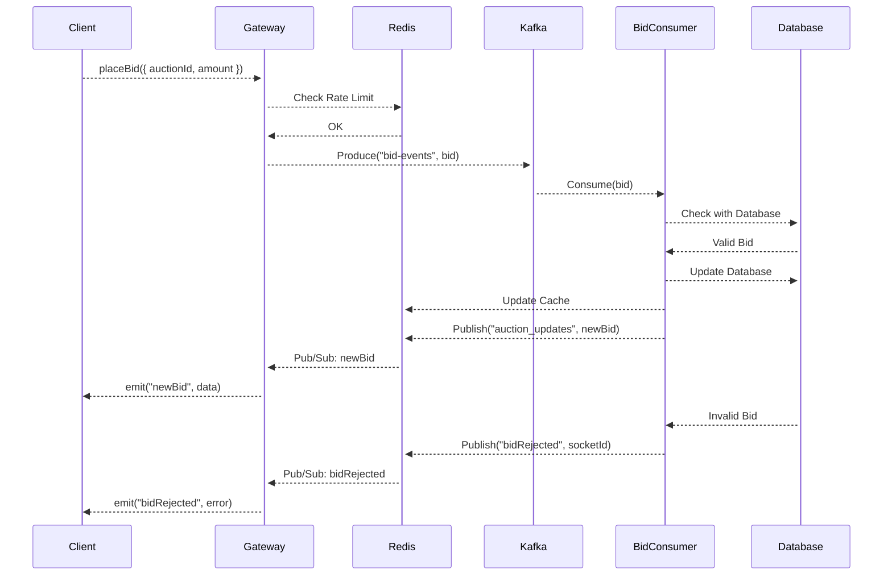

# Real-Time Car Auction Platform

This is a robust, real-time car auction platform built with **NestJS**. It showcases a scalable, event-driven architecture using Kafka for message queuing, Redis for caching and real-time messaging, and PostgreSQL with Prisma for the database layer.

The application allows users to register, log in, view auctions, and place bids in real-time. It's designed for high-concurrency scenarios, ensuring data consistency and a responsive user experience.

## Architecture

The application follows a decoupled, microservice-oriented architecture. The main components communicate asynchronously through Kafka and Redis, making the system resilient and scalable.

**Data Flow for Bidding:**

1.  **Client (Browser)**: Connects to the NestJS gateway via Socket.IO and places a bid with their auth token which they can get on login.
2.  **NestJS Gateway (`AuctionGateway`)**:
    *   Authenticates the user and validates the request.
    *   Applies rate limiting using Redis.
    *   Produces a `bid-event` to a Kafka topic without waiting for processing. This makes the gateway highly responsive.
3.  **Kafka**: The `bid-event` is partitioned by `auctionId` to ensure bids for the same auction are processed in order.
4.  **Bid Events Consumer (`BidEventsConsumerService`)**:
    *   Consumes the message from the `bid-events` topic.
    *   Processes the bid logic within a Prisma transaction to ensure atomicity.
    *   Checks for valid auction state, bid amount, and handles optimistic locking.
    *   On successful bid, it publishes a `newBid` event to a Redis Pub/Sub channel.
    *   If the bid fails, it publishes a `bidRejected` event to a dedicated Redis channel for the specific user.
5.  **Redis Pub/Sub**:
    *   The `RedisService` in the gateway subscribes to the Redis channels.
    *   When it receives a `newBid` message, it broadcasts the update to all clients in the corresponding auction room via Socket.IO.
    *   When it receives a `bidRejected` message, it emits an event to the specific client socket that made the invalid bid.



## Features

- **Real-Time Bidding**: Uses Socket.IO for low-latency communication between clients and the server.
- **Event-Driven Architecture**: Leverages Kafka to decouple services, enhancing scalability and resilience.
- **Scalable WebSockets**: Uses the `@socket.io/redis-adapter` to broadcast events across multiple server instances.
- **Robust Authentication**: JWT-based authentication (register/login) with password hashing via `bcryptjs`.
- **Role-Based Access Control (RBAC)**: Differentiates between `user` and `admin` roles, with guards protecting admin-only actions like ending an auction.
- **Database & ORM**: Utilizes PostgreSQL with Prisma for type-safe database access, transactions, and migrations.
- **Advanced Caching**: Caches auction state in Redis to reduce database load.
- **Rate Limiting**:
  - **Connection Limiting**: Restricts the number of concurrent WebSocket connections per user and IP address.
  - **Bid Throttling**: Limits the number of bids a user can place within a specific time window.
- **Optimistic Locking**: The `Auction` model includes a `version` field to prevent race conditions during concurrent bid processing.
- **Separate Consumers**: Dedicated Kafka consumers for different concerns:
  - `BidEventsConsumer`: Handles the core bidding logic.
  - `AuctionNotificationsConsumer`: A placeholder for sending notifications (e.g., email, SMS).
  - `AuditLogsConsumer`: Logs important events for auditing and monitoring.
- **Dockerized Services**: Kafka and Zookeeper are managed via Docker Compose for easy setup.

## Tech Stack

- **Backend**: NestJS
- **Real-time**: Socket.IO
- **Database**: PostgreSQL
- **ORM**: Prisma
- **Message Queue**: Apache Kafka
- **Caching & Pub/Sub**: Redis
- **Authentication**: JWT
- **Validation**: class-validator

---

## Getting Started

Follow these instructions to get the project up and running on your local machine.

### Prerequisites

- Node.js
- npm
- Docker and Docker Compose
- PostgreSQL
- Redis

For macOS users, PostgreSQL and Redis can be easily installed via Homebrew:

```bash
brew install postgresql@17
brew install redis
```

### 1. Clone the Repository

```bash
git clone https://github.com/ProfSnape07/real_time_car_auction
cd car_auction
```

### 2. Install Dependencies

```bash
npm install
```

### 3. Set Up Environment Variables

Create a `.env` file in the root of the project by copying the example file:

```bash
cp .env.example .env
```

Open the `.env` file and update the variables, especially `DATABASE_URL` and `JWT_SECRET` to match your local setup.

### 4. Start Dependent Services

Make sure PostgreSQL and Redis are running.

```bash
# Start PostgreSQL (if using Homebrew services)
npm run postgres:start

# Start Redis
npm run redis

# Build and start Kafka + Zookeeper containers
npm run kafka-build-start
```

### 5. Set Up the Database

Run the Prisma migrations to create the necessary tables in your PostgreSQL database.

```bash
npm run prisma:migrate
```

You can also use Prisma Studio to view and manage your data:

```bash
npm run prisma:studio:dev
```

### 6. Run the Application

```bash
npm run start:dev
```

The application will be running on `http://localhost:3000` depends on your `.env` settings. You can open the `src/index.html` file in your browser to interact with the auction system.

---

## Available Scripts

| Script                      | Description                                                                                     |
|:----------------------------|:------------------------------------------------------------------------------------------------|
| `npm run start:dev`         | Starts the application in watch mode.                                                           |
| `npm run build`             | Compiles the TypeScript source code.                                                            |
| `npm run prisma:migrate`    | Creates and applies a new database migration.                                                   |
| `npm run prisma:generate`   | Generates the Prisma Client based on `schema.prisma`.                                           |
| `npm run redis`             | Starts the `Redis` database server.                                                             |
| `npm run kafka-build-start` | Builds and starts the Kafka & Zookeeper Docker containers. Make sure Docker is already running. |
| `npm run kafka-stop`        | Stops the Kafka & Zookeeper containers.                                                         |
| `npm run kafka-stop-delete` | Stops and removes the Kafka & Zookeeper containers.                                             |

---

## API & WebSocket Events

### REST API

- `POST /auth/register`: Register a new user.
- `POST /auth/login`: Log in an existing user and get a JWT.
- `GET /auctions`: Get a list of all available auctions.

### WebSocket Events (Client → Server)

*Namespace: `/auction`*

- **`joinAuction`**: Join a specific auction room.
  - Payload: `{ auctionId: number }`
- **`placeBid`**: Place a bid on an auction.
  - Payload: `{ auctionId: number, amount: number }`
- **`endAuction`**: (Admin only) Manually end an auction.
  - Payload: `{ auctionId: number }`

### WebSocket Events (Server → Client)

- **`auctionState`**: Sent upon joining a room, contains the current state of the auction.
- **`newBid`**: Broadcast to the room when a new highest bid is placed.
- **`auctionEnd`**: Broadcast to the room when the auction is closed.
- **`bidRejected`**: Emitted to a specific client if their bid was rejected.
- **`connectionRejected`**: Emitted if the WebSocket connection is rejected (e.g., invalid token, rate limit exceeded).
- **`presenceDelta`**: Broadcasts when a user joins or leaves an auction room.

## Project Structure

```
src/
├── auction/      # Core auction logic (Gateway, Service, Controller)
├── auth/         # Authentication, Guards, and JWT strategy
├── kafka/        # Kafka producers and consumers
├── prisma/       # Prisma schema, migrations, and service
├── redis/        # Redis service, cache, and WebSocket adapter
├── app.module.ts # Root application module
├── constants.ts  # Application-wide constants
├── index.html    # Simple frontend client for testing
└── main.ts       # Application entry point
```
